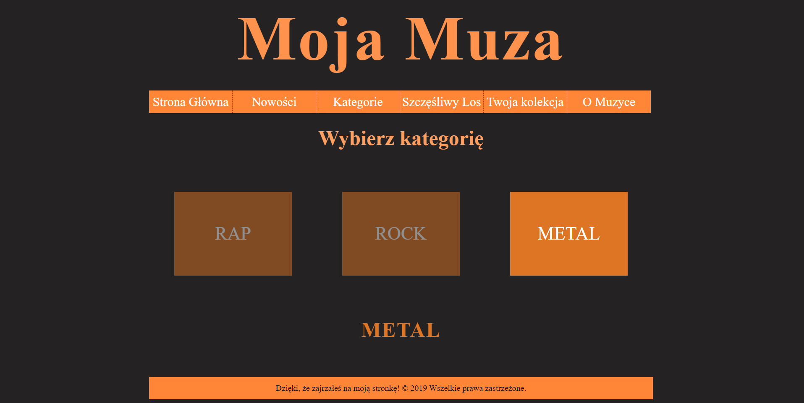

# Website - My Favourite Music 

## Sections

 - [Visuals](#visuals)
 - [Description](#description)
	 - [General](#general)
	 - [Main features](#main-features)
   - [Database](#database)
   - [Language](#language)
   - [Software Design Pattern](#software-design-pattern)
	- [Programming languages and libraries](#programming-languages-and-libraries)
 - [Usage](#usage)

## Visuals

## Description

### General
University project of a website about my favourite music

### Main Features
- Frontend features
  - responsive website
  - localStorage and sessionStorage
  - a few components from jQuery UI 
  - DOM operations
- Backend features
  - Uploading images to server
  - Adding watermark to uploaded images (PHP GD)
  - Gallery of uploaded images
  - User authentication
  - Session mechanism
  - AJAX - search gallery

### Database
MongoDB

### Software Design Pattern
MVC (without any framework)

### Language
Website interface language is polish

### Programming languages and libraries
 - HTML5
 - CSS
 - JavaScript
 - jQuery
 - jQuery UI
 - PHP
 - PHP GD

## Usage
 - University project
